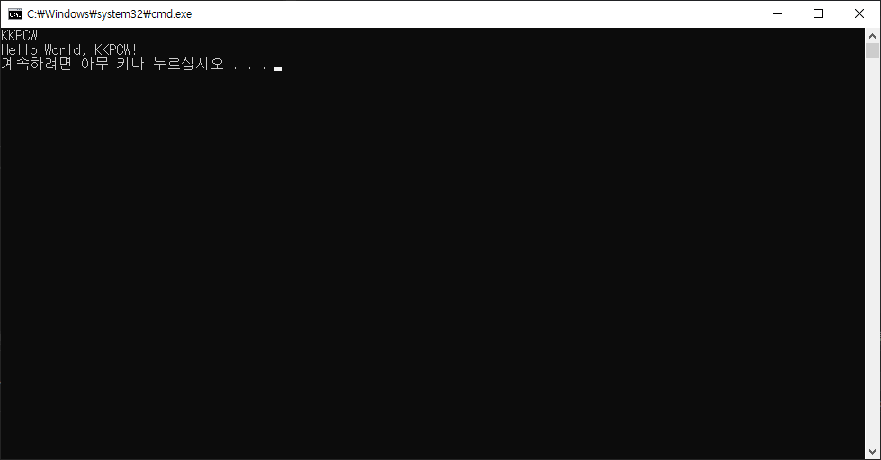

# CSharp_Learn
	C#을 배워봅시다

## HelloWorld.cs
	HelloWorld Code 살펴보기

```CSharp
	static void Main(string[] args)
	{
		Console.WriteLine("Hello World!");
	}
```

## 입력 받기
	문자를 입력 받아, 출력하기.

```CSharp
	Console.WriteLine($"Hello World, {Console.ReadLine()}!");
```

실행 결과

